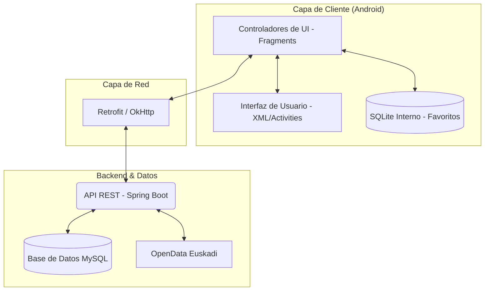

# Memoria Técnica: Proyecto InfoCam

## Índice
1. [Introducción](#1-introducción)
2. [Resumen del Proyecto](#2-resumen-del-proyecto)
3. [Arquitectura del Sistema](#3-arquitectura-del-sistema)
    - [Diagrama de Arquitectura](#diagrama-de-arquitectura)
    - [Patrón de Diseño (MVC)](#patrón-de-diseño-modelo-vista-controlador)
    - [Flujo de Datos](#flujo-de-datos)
4. [Stack Tecnológico](#4-stack-tecnológico)
    - [Lenguajes y Frameworks](#lenguajes-y-frameworks)
    - [Versiones Mínimas (Android)](#versiones-mínimas-android)
    - [Dependencias y Librerías Utilizadas](#dependencias-y-librerías-utilizadas)
5. [Estructura del Proyecto](#5-estructura-del-proyecto)
    - [Organización de Carpetas](#organización-de-carpetas)
6. [Componentes Clave y Funcionalidades](#6-componentes-clave-y-funcionalidades)
    - [Módulos Principales (Conexión API)](#módulos-principales-conexión-api)
    - [Modelo de Datos (SQLite)](#modelo-de-datos-sqlite)
    - [Navegación (Entre Pantallas)](#navegación-entre-pantallas)
7. [Interfaz de Usuario (UI/UX)](#7-interfaz-de-usuario-uiux)
8. [Seguridad y Gestión de Sesiones](#8-seguridad-y-gestión-de-sesiones)

---

## 1. Introducción
El proyecto **InfoCam** nace como una solución integral a la necesidad de centralizar la información sobre el estado del tráfico y la seguridad vial. En un entorno donde la movilidad es crítica, disponer de herramientas que permitan no solo consultar fuentes oficiales (como cámaras de tráfico) sino también fomentar la colaboración ciudadana a través del reporte de incidencias, resulta fundamental.

Esta aplicación ha sido desarrollada pensando en el conductor moderno, que busca inmediatez, fiabilidad y una interfaz intuitiva que no distraiga de lo importante. A lo largo de este documento, se desglosará cómo se ha construido esta solución, desde sus cimientos arquitectónicos hasta los detalles de implementación que garantizan una experiencia de usuario fluida y segura.

## 2. Resumen del Proyecto
InfoCam es un ecosistema tecnológico que permite la interacción en tiempo real con datos de tráfico geolocalizados. Sus pilares fundamentales son:
- **Visualización en Tiempo Real:** Acceso directo a las imágenes de cámaras de tráfico oficiales para comprobar el estado de la vía antes de iniciar un trayecto.
- **Participación Ciudadana:** Herramientas para que los propios usuarios reporten accidentes, obras o retenciones, creando una red de información viva y actualizada.
- **Personalización:** Un sistema de favoritos que permite al usuario "guardar" sus rutas o puntos críticos para una consulta rápida.
- **Sincronización Híbrida:** Capacidad de trabajar con datos remotos (API REST) y persistencia local (SQLite) para optimizar el rendimiento y la disponibilidad.

---

## 3. Arquitectura del Sistema

### Diagrama de Arquitectura
La robustez de InfoCam reside en su arquitectura desacoplada. El sistema no es un ente aislado, sino que interactúa con múltiples capas de servicios y datos:

### Patrón de Diseño (Modelo-Vista-Controlador)
Para garantizar la escalabilidad y mantenibilidad del código, se ha implementado una arquitectura basada en el patrón **MVC**:

1.  **Modelo (Model):** Ubicado en `com.infocam.model`. Aquí residen las "clases de negocio" como `Usuario`, `Incidencia` y `Camara`. Son objetos puros de Java (POJOs) que definen la estructura de la información que fluye por la app.
2.  **Vista (View):** Definida en los archivos XML del directorio `res/layout`. Se ha buscado un diseño moderno, utilizando `Material Design` para componentes como botones, tarjetas (`CardView`) y menús de navegación inferior.
3.  **Controlador (Controller):** Representado por las `Activities` y `Fragments` en `com.infocam.ui`. Actúan como puente: capturan las interacciones del usuario (pulsaciones en el mapa, envíos de formulario), solicitan datos al `DataRepository` y actualizan la Vista en consecuencia.

### Flujo de Datos
El flujo de datos se ha diseñado para ser asíncrono y no bloqueante. Cuando un usuario abre el mapa:
- Se lanza una petición `GET` a través de **Retrofit**.
- Los datos se descargan en segundo plano mientras el usuario ve una interfaz de carga o el mapa base.
- Una vez recibidos, la librería **Gson** transforma el JSON en una lista de objetos `Incidencia`.
- El controlador itera esta lista y añade marcadores dinámicos al mapa de **OSMDroid**.

---

## 4. Stack Tecnológico

La elección de tecnologías no ha sido azarosa, sino que responde a la búsqueda de equilibrio entre estabilidad, soporte de la comunidad y potencia.

### Lenguajes y Frameworks
- **Java:** Lenguaje principal por su madurez y tipado fuerte, lo que reduce errores en tiempo de ejecución.
- **Android SDK:** Se han utilizado componentes modernos como `FragmentContainerView` y `BottomNavigationView`.

### Versiones Mínimas (Android)
- **Min SDK 24 (Android 7.0):** Garantiza compatibilidad con más del 95% de los dispositivos activos en el mercado actual.
- **Target SDK 34 (Android 14):** Asegura que la aplicación cumple con los estándares más recientes de seguridad y rendimiento de Google.

### Dependencias y Librerías Utilizadas
| Librería | Justificación |
| :--- | :--- |
| **Retrofit 2** | Estándar de la industria para APIs REST. Maneja la concurrencia y los errores de red de forma elegante. |
| **OSMDroid** | Alternativa potente a Google Maps que permite mayor control sobre las fuentes de mapas y el manejo de capas offline. |
| **Glide** | Imprescindible para cargar las imágenes de las cámaras. Gestiona el caché de forma automática para no consumir datos innecesarios. |
| **PhotoView** | Proporciona una experiencia premium al permitir ampliar las imágenes de tráfico para ver detalles (ej. matrículas o nivel de retención). |

---

## 5. Estructura del Proyecto

### Organización de Carpetas
El proyecto sigue una estructura modular que facilita la localización de cualquier componente:

- `com.infocam.data`: El "almacén" de la app. Contiene el `DataRepository` (punto único de acceso a datos) y `SessionManager` (gestión de SharedPreferences).
- `com.infocam.model`: Definiciones de los objetos de datos.
- `com.infocam.network`: Configuración técnica de la comunicación (Retrofit).
- `com.infocam.ui`: La lógica visual, separada por componentes (mapa, favoritos, perfil).

---

## 6. Componentes Clave y Funcionalidades

### Módulos Principales (Conexión API)
La comunicación con el servidor se centraliza en `InfocamServiceClient`. Se ha implementado un patrón de **Retroalimentación Genérica** (`ApiCallback`), lo que permite que el controlador no tenga que preocuparse por los detalles técnicos de la red, solo por el resultado (Éxito o Error).

### Modelo de Datos (SQLite)
A diferencia de los datos volátiles de la API, los **Favoritos** se guardan en una base de datos local `SQLite`. Esto se hace mediante `DatabaseHelper`, permitiendo que el usuario pueda consultar sus cámaras guardadas incluso en situaciones de baja conectividad.

### Navegación (Entre Pantallas)
Se ha implementado un flujo de navegación circular y jerárquico:
- **Login/Registro:** Puerta de entrada con validación en tiempo real.
- **MainActivity:** El centro de mando. Usa un sistema de fragmentos para evitar la recreación de actividades pesadas, mejorando la velocidad de transición.
- **Pantallas de Detalle:** Como `FullScreenImageActivity`, diseñadas para tareas específicas y de corta duración.

---

## 7. Interfaz de Usuario (UI/UX)

La interfaz ha sido pulida para ofrecer un aspecto profesional y moderno. A continuación, se muestran algunos de los estados clave de la aplicación:

### Vista General del Mapa

*En esta pantalla se aprecia la integración de OSMDroid con marcadores personalizados para cámaras e incidencias.*

### Gestión de Filtros e Incidencias

*El panel de filtros permite al usuario limpiar el ruido visual y centrarse en la información que realmente le interesa.*

### Detalle de Incidencia y Reporte Ciudadano

*Formulario intuitivo que permite seleccionar fecha, hora y tipo de incidencia con selectores nativos de Android.*

### Perfil de Usuario

*Configuración centralizada del perfil y opciones de seguridad.*

---

## 8. Seguridad y Gestión de Sesiones

La seguridad es un pilar transversal en InfoCam:
1.  **Hasheo de Contraseñas:** En lugar de enviar contraseñas en texto plano, la app implementa `HashearPassword`, utilizando algoritmos de cifrado seguros antes de cualquier transmisión de datos.
2.  **Tokens de Sesión:** Una vez autenticado, el `SessionManager` guarda un token seguro. Esto evita que el usuario tenga que introducir sus credenciales cada vez que abre la app, protegiendo al mismo tiempo su identidad.
3.  **Validación de Datos:** Todos los formularios cuentan con validación tanto en el cliente (para inmediatez) como en el servidor (para integridad).
