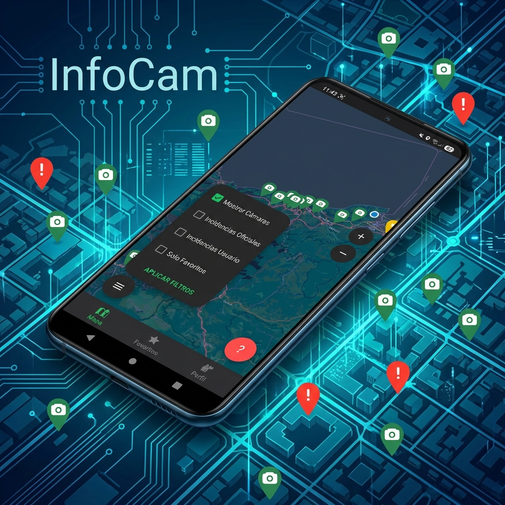
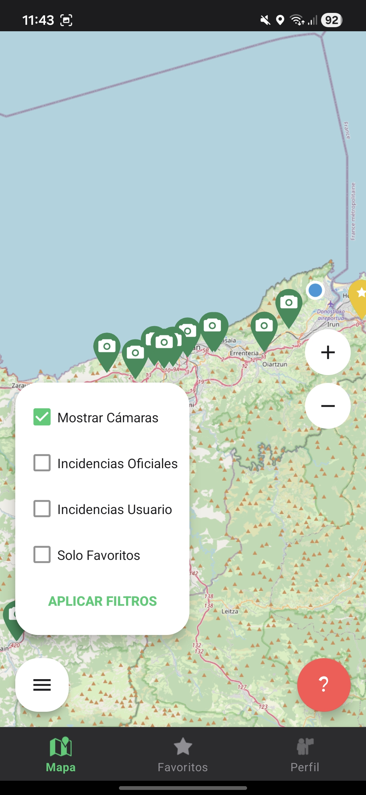
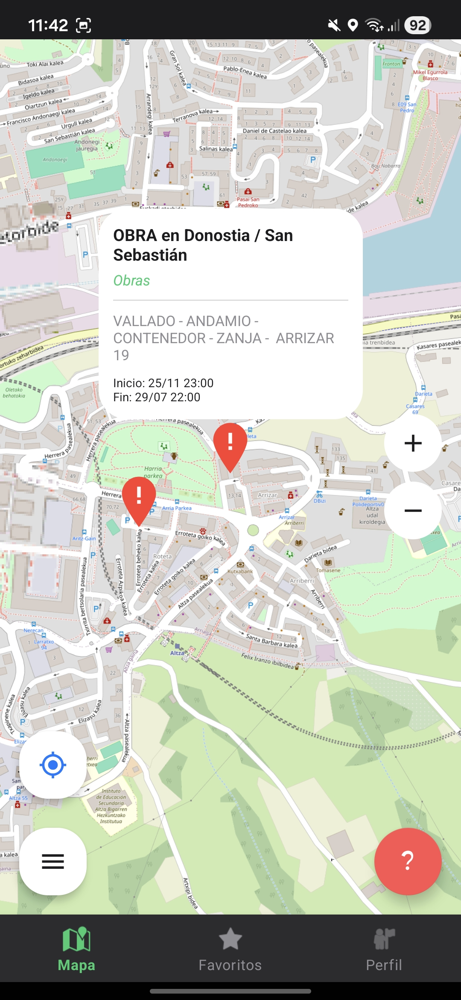

# InfoCam: Gestión Inteligente del Tráfico en Euskadi

**InfoCam** es una solución integral diseñada para mejorar la movilidad y la seguridad vial en el País Vasco. Esta plataforma permite a los usuarios monitorear el estado del tráfico en tiempo real, consultar cámaras oficiales y colaborar mediante el reporte ciudadano de incidencias.

El proyecto nace de la necesidad de centralizar la información dispersa de múltiples fuentes (Trafikoa Euskadi, Bizkaia, Bilbao, etc.) en una experiencia de usuario fluida, moderna y accesible desde dispositivos Android.

---

## Funcionalidades Clave

- **Mapa Interactivo en Tiempo Real**: Visualización dinámica de cámaras e incidencias sobre una capa de OpenStreetMap.
- **Red de Cámaras Unificada**: Acceso instantáneo a las imágenes en vivo de los principales nodos de tráfico de la región.
- **Gestión de Incidencias 360°**: 
    - Sincronización automática con fuentes gubernamentales.
    - Sistema de **Crowdsourcing**: Los usuarios pueden reportar accidentes, retenciones u obras de manera inmediata.
- **Sistema de Favoritos**: Personaliza tu experiencia guardando las rutas y cámaras que más te importan.
- **Comunidad y Perfiles**: Gestión de usuarios para fomentar la participación activa y personalizada.

---

## Contrucción de la Aplicación

### Frontend (Android)
Desarrollado con un enfoque en la robustez y la experiencia de usuario:
- **Lenguaje**: Java 17.
- **Arquitectura**: Patrón **MVC** para una separación de responsabilidades clara.
- **Tecnologías Core**:
    - `osmdroid`: Control total sobre la renderización de mapas.
    - `Retrofit & Gson`: Comunicación eficiente y tipada con la API REST.
    - `Glide`: Optimización de memoria en la carga de imágenes de cámaras.
    - `Material Design 3`: UI/UX moderna con soporte para temas dinámicos.

### Backend (Java API)
Una infraestructura escalable y precisa:
- **Framework**: Spring Boot 3.x.
- **Base de Datos**: MySQL (JPA/Hibernate).
- **Geolocalización**: Integración de `Proj4J` para la conversión precisa de coordenadas **UTM (ETRS89) a WGS84**, garantizando que cada punto en el mapa sea exacto.

---

## Un Pequeño Vistazo al Proyecto

| Mapa e Incidencias | Reporte de Usuario |
|:---:|:---:|
|  |  |
| *Visualización dinámica con filtros.* | *Interfaz intuitiva para reportes rápidos.* |

---

## Organización del Proyecto

La estructura sigue estándares profesionales para facilitar el mantenimiento y la escalabilidad:

- `com.infocam.ui`: Actividades y Fragmentos que gestionan la interacción del usuario.
- `com.infocam.model`: POJOs [Plain Old Java Objects] y modelos de datos (Cámara, Incidencia, Usuario).
- `com.infocam.network`: Configuración de Retrofit y servicios API.
- `com.infocam.adapter`: Gestión de listas dinámicas y RecyclerViews.

---

## Instalación y Configuración

Para poner en marcha el proyecto en tu entorno local o instalar la aplicación en un dispositivo físico, consulta nuestra guía detallada:

Instrucciones detalladas en: **[Guía de Instalación (INSTALL.md)](INSTALL.md)**

---

## Contexto Académico

Este proyecto ha sido desarrollado como el **Reto 2** del segundo curso del Ciclo Formativo de Grado Superior en **Desarrollo de Aplicaciones Multiplataforma (DAM)**.

---

Desarrollado por el equipo de **InfoCam** - 2026.
